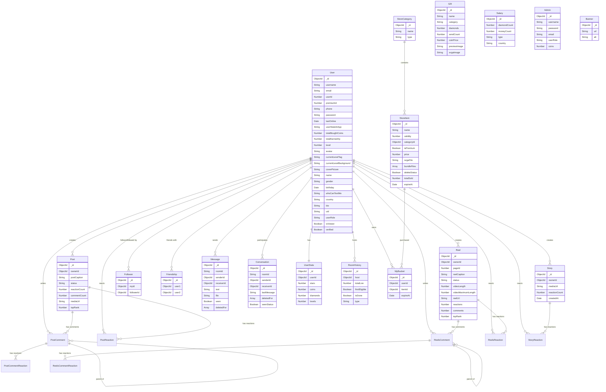

# Adda Live Backend

A comprehensive real-time live streaming and social media backend application built with Node.js, Express, Socket.IO, and MongoDB. This application powers a social platform with live audio/video streaming, posts, reels, stories, messaging, virtual gifts, and an in-app economy.

## 📋 Table of Contents

- [Overview](#overview)
- [Technology Stack](#technology-stack)
- [Features](#features)
- [Database Schema](#database-schema)
- [Installation](#installation)
- [Environment Variables](#environment-variables)
- [API Routes](#api-routes)
- [Real-Time Features](#real-time-features)
- [Cron Jobs](#cron-jobs)

## 🎯 Overview

Adda Live is a feature-rich backend system designed for a social media and live streaming platform. It combines traditional social media features (posts, stories, reels) with real-time capabilities (live streaming, instant messaging) and gamification elements (coins, diamonds, levels, gifts).

**Author:** Dewan A M Nashifuzaaman

## 🛠 Technology Stack

- **Runtime:** Node.js with TypeScript
- **Framework:** Express.js
- **Database:** MongoDB with Mongoose ODM
- **Real-time Communication:** Socket.IO
- **Authentication:** JWT (JSON Web Tokens)
- **Media Storage:** Cloudinary
- **Live Streaming:** Agora SDK
- **Password Hashing:** bcrypt
- **Task Scheduling:** node-cron
- **Development:** ts-node-dev for hot reloading

## ✨ Features

### Social Media Features
- **Posts:** Create, view, like, and comment on multimedia posts
- **Reels:** Short-form video content with engagement tracking
- **Stories:** 24-hour temporary content with reactions
- **Comments:** Nested commenting system with reactions
- **Followers:** User following system for content discovery

### Real-Time Features
- **Live Streaming:** Audio and video streaming with Agora integration
- **Instant Messaging:** One-on-one chat with media support
- **Socket-based Notifications:** Real-time updates for all activities
- **Live Rooms:** Host-managed streaming rooms with audience interaction

### Gamification & Economy
- **Multi-Currency System:**
  - **Coins:** Primary currency for purchases
  - **Diamonds:** Premium currency for special items
  - **Stars:** Engagement-based rewards
  - **XP (Experience Points):** Level progression system
- **Virtual Gifts:** Send animated gifts during streams
- **User Levels:** Progressive leveling system with custom tags and backgrounds
- **Store System:** Purchase profile decorations, effects, and premium items

### Administrative Features
- **Admin Panel:** Comprehensive management dashboard
- **Content Moderation:** Review and manage user-generated content
- **Analytics:** Track user engagement and monetization
- **Salary System:** Creator compensation based on streaming performance
- **Banner Management:** Dynamic promotional content

## 📊 Database Schema

The application uses MongoDB with Mongoose ODM. Below is a comprehensive overview of the database structure and relationships.

### Entity Relationship Diagram



### Database Collections Overview

#### 1. **User** Collection
The central entity of the application storing all user information.

**Key Features:**
- Unique user identification (userId, uid, email, phone)
- Profile customization (avatar, cover picture, bio)
- Level progression system with custom tags and backgrounds
- Activity zone management for content moderation
- Role-based access control (User, Creator, Admin)
- Premium user support

**Relationships:**
- One-to-One with UserStats
- One-to-Many with Posts, Reels, Stories
- Many-to-Many with other Users (Followers, Friendships)

#### 2. **UserStats** Collection
Tracks user's in-app currency and progression metrics.

**Currencies:**
- **Stars:** Earned through engagement and streams
- **Coins:** Primary currency for purchases
- **Diamonds:** Premium currency, convertible to real money
- **Levels:** Overall user progression

#### 3. **Post** Collection
Traditional social media posts with multimedia support.

**Features:**
- Media attachments (images/videos)
- Caption support
- Engagement tracking (reactions, comments)
- Content ranking system (topRank)
- Status management (active/inactive)

#### 4. **Reel** Collection
Short-form video content similar to TikTok/Instagram Reels.

**Features:**
- Video length validation (max 60 seconds default)
- Page-based organization
- Reaction and comment system
- Ranking algorithm support

#### 5. **Story** Collection
Temporary 24-hour content that auto-expires.

**Features:**
- Automatic TTL (Time To Live) deletion after 24 hours
- Media URL storage
- Reaction tracking
- Owner-based filtering

#### 6. **Message & Conversation** Collections
Real-time messaging system.

**Message Features:**
- Text and file support
- Read receipt tracking
- Soft delete functionality (deletedFor array)
- Room-based organization

**Conversation Features:**
- Unique room IDs for each chat
- Last message preview
- Seen status tracking
- Soft delete support per user

#### 7. **Follower & Friendship** Collections
Social graph management.

**Follower:**
- Asymmetric relationships (one-way follow)
- Composite unique index prevents duplicates

**Friendship:**
- Symmetric relationships (mutual friends)
- Bidirectional connections between users

#### 8. **Comment Collections** (Post/Reels)
Nested commenting system with reactions.

**Features:**
- Parent-child comment relationships (replies)
- Reaction counting
- Direct references to parent content
- User attribution

#### 9. **Reaction Collections** (Post/Reels/Story)
Engagement tracking through likes and reactions.

**Features:**
- Multiple reaction types support
- User and content linking
- Timestamp tracking for analytics

#### 10. **Gift** Collection
Virtual gifts for live streaming interactions.

**Features:**
- Diamond-based pricing
- Category organization
- SVGA animation support
- Send count tracking for popularity metrics

#### 11. **RoomHistory** Collection
Tracks live streaming sessions.

**Features:**
- Host attribution
- Stream type (Audio/Video)
- Duration and completion tracking
- Eligibility flags for rewards
- Separate collection for withdrawal history

#### 12. **Store Collections** (StoreCategory, StoreItem, MyBucket)
In-app marketplace for cosmetic items.

**StoreCategory:**
- Organizes items by type (frames, backgrounds, effects)

**StoreItem:**
- Validity periods (temporary/permanent)
- Premium item flags
- Bundle support for multiple files
- Soft delete with TTL expiration
- Sales tracking

**MyBucket:**
- User's purchased items inventory
- Expiration tracking for temporary items

#### 13. **Salary** Collection
Creator compensation system.

**Features:**
- Diamond-to-money conversion rates
- Country-specific pricing
- Stream type differentiation (Audio/Video)

#### 14. **Admin** Collection
Administrative user management.

**Features:**
- Separate authentication from regular users
- Role-based permissions
- Coin management for testing/rewards

#### 15. **Banner** Collection
Promotional content management.

**Features:**
- Image URL storage
- Alt text for accessibility

#### 16. **History** Collection
Transaction and activity logging.

**Features:**
- Gold and diamond tracking
- Total amount calculations
- User-linked records

## 🚀 Installation

### Prerequisites
- Node.js (v14 or higher)
- MongoDB (v4.4 or higher)
- npm or yarn package manager

### Steps

1. Clone the repository:
```bash
git clone https://akmsaharu@bitbucket.org/sgdsoft/livestreamingbackend.git
cd adda-live
```

2. Install dependencies:
```bash
npm install
# or
yarn install
```

3. Configure environment variables (see [Environment Variables](#environment-variables))

4. Start the development server:
```bash
npm run dev
# or
yarn dev
```

5. Build for production:
```bash
npm run build
npm start
```

## 🔐 Environment Variables

Create a `.env` file in the root directory with the following variables:

```env
# Server Configuration
PORT=8000
NODE_ENV=development

# Database
MONGO_URL=mongodb://localhost:27017/addlive

# Authentication
SESSION_SECRET=your_session_secret_here
JWT_SECRET=your_jwt_secret_here

# Cloudinary (Media Storage)
CLOUDINARY_CLOUD_NAME=your_cloud_name
CLOUDINARY_API_KEY=your_api_key
CLOUDINARY_API_SECRET=your_api_secret

# Agora (Live Streaming)
AGORA_APP_ID=your_agora_app_id
AGORA_APP_CERTIFICATE=your_agora_certificate

# CORS Origins (comma-separated)
ALLOWED_ORIGINS=http://localhost:3004,https://admin.zigoliveapp.xyz
```

## 🔌 API Routes

The application exposes the following API endpoints:

| Route | Purpose | Authentication |
|-------|---------|----------------|
| `/api/auth` | User authentication & registration | Public |
| `/api/admin` | Admin panel operations | Admin only |
| `/api/reels` | Reels management (CRUD) | Required |
| `/api/posts` | Posts management (CRUD) | Required |
| `/api/stories` | Stories management (CRUD) | Required |
| `/api/chats` | Messaging operations | Required |
| `/api/games` | Gamification features | Required |
| `/api/followers` | Follow/unfollow operations | Required |
| `/api/power-shared` | Portal user management | Required |
| `/api/store` | In-app store operations | Required |
| `/release` | App version management | Public |
| `/api/gifts-audio-rocket` | Gift system for streams | Required |
| `/api/blocked-emails` | Email blocking management | Admin only |
| `/api/diamond-exchange` | Currency exchange operations | Required |
| `/api/upload-file-local` | Local file upload | Required |

## 🔄 Real-Time Features

The application uses Socket.IO for real-time bidirectional communication.

**Socket Events:**
- User connection/disconnection tracking
- Live streaming room management
- Instant message delivery
- Real-time notifications
- Gift animations during streams
- Presence indicators
- Typing indicators

Socket server is initialized on the same HTTP server as Express and handles authentication through JWT tokens.

## ⏰ Cron Jobs

Scheduled tasks run automatically using node-cron:

| Schedule | Task | Description |
|----------|------|-------------|
| `0 0 * * *` | Reset XP Tracking | Resets daily XP tracking system at midnight |
| `0 0 * * 0` | Room Support Rewards | Distributes weekly rewards every Sunday at midnight |

Jobs are managed by the `CronManager` singleton class for centralized control.

## 📁 Project Structure

```
adda-live/
├── src/
│   ├── controllers/      # Request handlers
│   ├── core/            # Core utilities
│   │   ├── errors/      # Error handling
│   │   ├── middlewares/ # Auth, validation, etc.
│   │   ├── sockets/     # Socket.IO server
│   │   ├── corn/        # Cron job definitions
│   │   └── Utils/       # Helper functions
│   ├── dtos/            # Data Transfer Objects
│   ├── entities/        # TypeScript interfaces
│   ├── models/          # Mongoose schemas
│   ├── repository/      # Data access layer
│   ├── router/          # Express routes
│   ├── services/        # Business logic
│   └── server.ts        # Application entry point
├── public/              # Static files
├── dist/                # Compiled JavaScript
├── .env                 # Environment variables
├── package.json         # Dependencies
└── tsconfig.json        # TypeScript configuration
```

## 🔒 Security Features

- **JWT Authentication:** Secure token-based authentication
- **Password Hashing:** bcrypt for secure password storage
- **CORS Protection:** Configurable origin whitelist
- **Session Management:** Express-session for state management
- **Input Validation:** class-validator for DTO validation
- **Activity Zones:** Content moderation and user safety zones

## 🎮 Gamification System

### Level System
Users earn XP through various activities:
- Streaming duration
- Gift reception
- Engagement (likes, comments, shares)
- Daily login streaks

### Currency Flow
```
Real Money → Coins (Purchase)
Streaming/Gifts → Diamonds (Earn)
Diamonds → Real Money (Withdraw via Salary System)
Engagement → Stars (Earn)
Stars/Coins → Store Items (Spend)
```

## 📈 Analytics & Tracking

The system tracks:
- User engagement metrics
- Stream performance
- Gift popularity
- Revenue analytics
- Content performance (top ranked posts/reels)
- User retention metrics

## 🤝 Contributing

This is a private project. For collaboration inquiries, contact the project owner.

## 📄 License

ISC License - Copyright (c) Dewan A M Nashifuzaaman

## 📞 Support

For issues and feature requests, please contact the development team or create an issue in the repository.

---

**Note:** This application is designed for production deployment with proper scaling considerations. Ensure MongoDB is properly indexed and Socket.IO is configured with Redis adapter for horizontal scaling in production environments.
